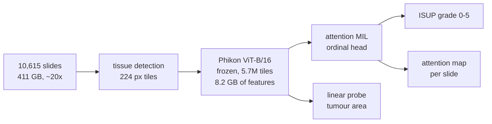

# Prostate cancer grading from whole-slide images

Slide-level ISUP grading of 10,615 prostate biopsies (Kaggle PANDA) with attention-based
multiple-instance learning on frozen pathology foundation-model features — plus an audit of what
the model actually looks at, and how little of it survives a change of hospital.


| | quadratic weighted kappa |
|---|---|
| **Attention MIL (ABMIL)** | **0.897 ± 0.004** |
| Mean-pooling baseline | 0.842 ± 0.005 |

Attention beats the baseline by 0.055, more than ten times the 0.004 spread across folds. Trained
on one hospital and tested on the other, kappa collapses from 0.86–0.90 to 0.21–0.31: the model
has learned a good deal of site-specific appearance along with the cancer.

Two checks against the pixel-level masks, which the model never sees while training:

- attention separates cancer tiles from cancer-free ones at **0.88** median AUC (Radboud)
- a linear probe on the frozen features predicts each slide's tumour area at **r = 0.94**

[RESULTS.md](RESULTS.md) has the per-fold tables, the confusion matrices and the honest limits.

## What the model looks at

Left: the slide. Middle: where the attention went. Right: the cancer tiles according to the mask.
Rows 1–2 are high-grade slides the model gets right for the right reason, row 3 is a typical
slide, row 4 is a failure, and row 5 is benign tissue for contrast.


The failure row is the interesting one: an ISUP 3 slide predicted as 1, where attention spreads
over benign tissue and misses the cancer the mask marks.

## Pipeline



Stage 1 runs on Kaggle, where the slides are already mounted; stage 2 runs anywhere with a GPU,
because the features are only 8.2 GB. On an A100 the whole training run took under an hour.

## Running it

**Stage 1 — features (Kaggle).** `notebooks/01_extract_features.ipynb` with GPU T4 x2, Internet
on, the `prostate-cancer-grade-assessment` competition attached, and a `KAGGLE_KEY` notebook
secret. Dry-run it first with `DEBUG_SLIDES = 50` to check the tiling pictures and the time
estimate, then set `DEBUG_SLIDES = None` and use Save & Run All (about 4.5 hours). Output goes to
a private Kaggle dataset, uploaded part by part, so a crash or the 12-hour session limit costs at
most one part of ~1,000 slides.

Saved per tile: the feature vector, the slide and level-0 position, the tissue fraction, and from
the label masks the cancer, epithelium and Gleason 3/4/5 fractions.

**Stage 2 — training (any GPU box).**

```bash
kaggle datasets download kumaarbalbir/panda-phikon-features -p data --unzip
./sync.sh                                    # copies the code, not the data, to the GPU box
CUDA_VISIBLE_DEVICES=3 python train.py --features data/pda-ft --out results --quiet
```

Needs `torch numpy pandas pyarrow scikit-learn scipy matplotlib tqdm`, plus `openslide-python` and
`openslide-bin` only for `--slides-dir` (heatmaps over the slide images). Finished folds are
skipped on a rerun, so an interrupted run continues. `python train.py --help` lists the settings.

**Stage 3 — heatmaps (Kaggle).** `notebooks/03_heatmaps.ipynb` draws the figure above. The
attention values for the example slides are baked into the notebook by
`src/make_heatmap_notebook.py`, so it needs no GPU and no upload of results — just the slide
images. Regenerate it after a new run with:

```bash
python src/make_heatmap_notebook.py && python src/build_notebooks.py
```

## How it is evaluated

- Quadratic weighted kappa, the PANDA competition's metric, under 5-fold cross-validation
  stratified by hospital and grade. Each fold picks its epoch on 10% of its own training slides,
  so the fold it is scored on stays untouched, and the spread across folds shows how large a
  difference has to be before it means anything.
- Mean pooling over tiles as a baseline, to show what the attention is worth.
- Train on one hospital, test on the other: what a deployed model would face at a new site.
- Attention and tumour area are checked against masks that never enter training.

## Layout

    train.py                              stage 2 (the one to run)
    sync.sh                               rsync the code to a GPU box
    notebooks/01_extract_features.ipynb   stage 1, generated from src/
    notebooks/02_train_mil.ipynb          stage 2 as a Kaggle notebook (fallback if no server)
    notebooks/03_heatmaps.ipynb           stage 3, generated from src/
    src/01_extract_features.py            notebook sources in `# %%` percent format
    src/02_train_mil.py
    src/03_heatmaps_template.py           heatmap notebook without the baked-in attention
    src/make_heatmap_notebook.py          picks example slides and writes src/03_heatmaps.py
    src/make_figures.py                   draws figures/results_summary.png from results.json
    src/build_notebooks.py                rebuilds notebooks/*.ipynb from src/*.py
    figures/, RESULTS.md                  what the run produced
    data/, results/                       not in git

Edit `src/*.py` and run `python src/build_notebooks.py` rather than editing the notebooks.
`train.py` holds the same training logic as notebook 2; keep the two in step.

## Data

[PANDA](https://www.kaggle.com/c/prostate-cancer-grade-assessment) — 10,616 biopsies from Radboud
University Medical Center and Karolinska Institutet, with ISUP grades and pixel-level masks. The
slides are not redistributed here, and the derived features live in a private Kaggle dataset.
