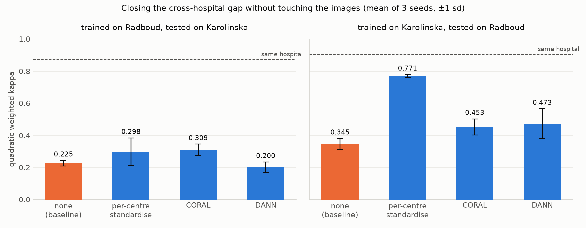

# Results

One run of `train.py` on 10,615 slides and 5,686,231 tiles: 20 epochs, 5 folds, seed 0, about
50 minutes on one A100. Raw numbers in `results/results.json` (not in git).

## Grading

Quadratic weighted kappa, the metric the PANDA competition used. Folds are stratified by hospital
and grade; each fold's model picks its epoch on 10% of its own training slides, so the fold it is
scored on stays untouched.

| Model | QWK (mean ± sd) | Karolinska | Radboud |
|---|---|---|---|
| **ABMIL** (gated attention) | **0.897 ± 0.004** | 0.917 | 0.857 |
| Mean pooling | 0.842 ± 0.005 | 0.814 | 0.819 |

Per fold, ABMIL scores 0.891–0.901 and mean pooling 0.837–0.850, so the 0.055 gap never comes
close to overlapping. Attention is doing real work: a biopsy is mostly benign tissue, and
averaging over every tile dilutes the few that carry the grade.

Both models are better on Karolinska slides than Radboud ones, which matches Karolinska being the
larger and more class-balanced half of the dataset.

Mistakes sit next to the diagonal: the model confuses neighbouring grades, which is what the
quadratic weighting forgives and what pathologists disagree about too.

## Cross-hospital robustness

Train on one hospital, hold out 20% of it as an in-hospital test set, then test on the other
hospital as well.

| Trained on | Same hospital | Other hospital |
|---|---|---|
| Radboud | 0.860 | **0.205** |
| Karolinska | 0.899 | **0.305** |

Roughly three quarters of the performance disappears at a new site. Since both halves are the same
disease and the same grading scale, what fails to transfer is appearance: different scanners,
stains and grading habits. This is the case for stain normalisation and colour augmentation, and
it is the number to quote when someone asks what a deployed model would do at their lab.

## Closing the cross-hospital gap without new images

If the drop above is caused by the *features* rather than the slides, it can be fixed after the
fact. `adapt.py` tries three standard corrections, each trained on one hospital and scored at both,
using only unlabelled target features and never target grades. Three seeds, mean ± sd:

| method | Radboud → Karolinska | Karolinska → Radboud |
|---|---|---|
| none (baseline) | 0.225 ± 0.018 | 0.345 ± 0.036 |
| **per-centre standardisation** | 0.298 ± 0.087 | **0.771 ± 0.008** |
| CORAL | 0.309 ± 0.036 | 0.453 ± 0.050 |
| DANN (gradient reversal) | 0.200 ± 0.033 | 0.473 ± 0.092 |

In-hospital accuracy is untouched by all three (0.85–0.91 throughout), so nothing is traded away.

The result splits by direction:

- **Karolinska → Radboud is largely a feature-scale problem.** Standardising each hospital's
  features with its own mean and sd lifts kappa from 0.345 to 0.771 — a 0.43 gain against a 0.01
  seed spread, recovering most of the 0.905 the model scores at home.
- **Radboud → Karolinska is not.** The best fix (CORAL, 0.309) beats the baseline by 0.08, only
  about twice the seed spread, and per-centre standardisation is within noise. Whatever separates
  these two directions survives every affine correction of the features.

So part of the gap is a shift you can undo in feature space, and part is not. That remaining part
is the case for fixing the *images* instead, which is what the Macenko stain-normalisation run in
`notebooks/01_extract_features.ipynb` (`STAIN_NORMALISE = True`) is for.

A caveat worth stating: per-centre standardisation and CORAL both need a batch of slides from the
new hospital before they can help, so they suit a lab deploying on its own archive, not a
slide-by-slide service.

## What the model looks at

The masks are never used in training, so comparing attention to them is a genuine check.

- Attention separates cancer tiles from cancer-free ones at **0.88** median AUC (Radboud) and
  **0.77** (Karolinska), over 7,455 out-of-fold slides that have a mask and some cancer.
- A linear probe on the frozen tile features detects cancer tiles at **AUC 0.94**.
- The share of tiles it calls cancer tracks the mask's share at **r = 0.94** per slide, so the
  pipeline also quantifies tumour area rather than only grading.

Five slides from `notebooks/03_heatmaps.ipynb`: two where attention lands squarely on the mask's
cancer (one per hospital), a typical slide at the median localisation AUC, a failure where
attention avoids the cancer (ISUP 3 predicted as 1, AUC 0.03), and a benign slide for contrast.
Attention is rank-scaled per slide, since the raw weights sum to one and shrink as a slide has
more tiles.

## Honest limits

- Cross-validation on the public training set, not the competition's private test set, so these
  numbers are not directly comparable to the leaderboard (winners were around 0.93–0.94 there).
- PANDA's labels are known to be noisy, especially the Karolinska half, which caps what any model
  can score.
- Tiles are capped at 2,048 per slide and sampled to 512 per training step; a handful of large
  slides are therefore only partly seen during any one step.
- The cancer-tile definition treats a tile as cancer when at least half its labelled epithelium is
  cancer. Radboud masks label glands and stroma separately, Karolinska's do not, so the two
  hospitals' tile labels are not exactly the same thing.
- One slide of 10,616 was dropped: no tile passed the tissue threshold.
